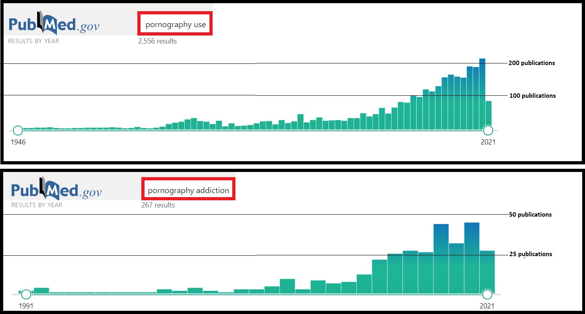

¿Quieres leer el artículo en español? <a href="/Adictos-al-porno">Encuéntralo aquí.</a>

There is a questionless fact: people like porn. And people are lucky, because thanks to triple A - accessibility, affordability, anonymity - pornography is in everyone's hands (and never better said). In 2019 alone there were 42,000,000,000,000 visits to one of the most popular porn sites worldwide, which corresponds to 115 million per day (Pornhub, 2019). In other words, it is as if the entire populations of the states of California, Texas, Florida, New York and Colorado combined visited the site every day. 

Pornography is increasingly present in our lives. It is being talked about more and more openly. Now more than ever it is a hot topic since the pandemic has completely changed our routine. We spend more time in front of screens and, not very surprisingly, also watching pornography.

But it is not only pornography that has gained ground in our daily lives. Concepts such as "pornography addiction" or "excessive consumption of pornography" have also emerged. The question is whether or not we should be concerned about it.

### Does porn addiction exist?

Porn addiction is not an officially recognized psychological disorder. There are no official diagnostic criteria or treatments, nor is it included in any official psychology manual. It is difficult to study porn addiction as a separate phenomenon from sex addiction. However, even sex addiction is not recognized today by the major psychological reference manuals. For example, the Diagnostic and Statistical Manual of Mental Disorders (DSM) stopped including sex addiction from the fourth edition in 2000. Despite repeated attempts to include the disorder in the DSM-5 in 2013, there was insufficient evidence to do so. Even the tenth edition (the latest, to date) of the International Statistical Classification of Diseases and Related Health Problems (ICD-10) does not consider porn addiction as a separate phenomenon from others that are included, such as excessive sexual drive or excessive masturbation (Wikipedia contributors, 2021).

Although porn addiction is not considered an official mental disorder, its presence in popular culture and scientific literature is undeniable (see Figure 1). However, since it is not recognized as a clinical reality, it is often referred to as Self Perceived Pornography Addiction (SPPA). Do we all use the same criteria when judging what is a low, a moderate or a high pornography consumption? Certainly not. In a review published by Duffy et al. (2016) comparing several articles on porn addiction, the authors found a large discrepancy in the definition of what is heavy consumption. While some authors consider watching porn 10 times or more in three months to be excessive consumption, others consider that the limit would be exceeding one visit per day (i.e., 90 times in three months, 9 times more than the first ones). This disparity in the definition affects the conclusions of the studies.

  
  <figcaption>Figure 1. Number of publications on “Pornography use” and “Pornography addiction” by year in the pubmed database.</figcaption>

The recognition of pornography addiction as a real phenomenon is far from unanimous. On the one hand, there are those who argue that one may or may not define one's consumption as excessive regardless of the amount of pornography consumed. For these, those who speak of excessive pornography consumption base their judgement on their own ideas associated with sex, on their religiosity and moral attitudes (rather than on the actual amount of pornography consumed). It should be noted that many of the definitions of pornography proposed in the articles imply that it is a form of infidelity. On the other hand, there are those who believe that porn addiction should be considered a reality given that the frequency of its use has consequences. And not only in user, but also in their partners. Let's clarify the issue a bit.

#### What the ones who claim the existence of porn addiction tell us

Pathological pornography consumption occurs mainly in men. According to the review by Duffy et al. (2016), most of the articles included in the analysis consider that men consume pornography excessively. Those that include women are limited to analysing how they are affected by their partners' excessive porn consumption. However, this imbalance is most likely the result of the methodological poverty of the studies and not a reflection of reality.

Self-perceived porn addiction is defined as an excessive and uncontrollable consumption of pornography, which would affect both consumers and their partners. In addition to the notion of frequency and control, the consequences of this behaviour must be considered. Porn addiction is often associated with feelings of isolation, irritability, depression, impaired concentration, disconnection with sexuality, family problems, relationship problems, sexual problems, and difficulties in the workplace. Those who defend the existence of porn addiction are based on the idea that a person's sexual life should be built on regular interpersonal sexual relations and a minimal presence of masturbation (Voros, 2009).

#### What the ones who deny the existence of porn addiction tell us

Consuming porn is a perfectly healthy behaviour. Its medicalization began in the late 70s, when the terminology used in Alcoholics Anonymous groups began to be used in other areas such as sex. In the 90s the concept of cyberaddiction emerged, which encompassed compulsive online shopping, sex addiction and gaming addiction. These behaviours shared one feature: they were ways of escaping from reality. Thus, porn addiction was gaining presence in popular discourse, and was spreading in opinion platforms (Voros, 2009). The way in which the connotations associated with porn evolve in parallel to other sociological phenomena means that porn addiction is seen not so much as a medical problem but as a malleable concept. Ley (2021) explains that considering oneself as having an addiction can be a source of stress. According to this point of view, the mere diagnosis of addiction gives rise to emotional distress wrongly attributed to a supposedly excessive consumption of pornography. Another argument used to deny porn addiction is that it is a moralistic construct or based on religiously biased arguments, with the sole purpose of maintaining order in sexual practice. It is also argued that there are clear interests to defend its existence and medicalization. However, this is not a very solid argument since the porn industry also has interests (and power) to deny its existence.

### Porn in our daily lives

The way men and women consume porn is different. This is an important aspect when considering its effects. Men tend to consume pornography alone, they choose videos that are limited to the sexual act without any kind of story behind it, and sometimes they do not even see the faces of the actors and actresses. Women tend to consume pornography with their couple and prefer videos with more egalitarian sexual relations and with some context (Weir, 2014). Therefore, if there are consequences linked to pornography, this gender difference in its consumption should be taken into account. According to Duffy et al. (2016), certain of the studies included in the review found no evidence on the impact of porn consumption by self-perceived addicts on their partners, others found a negative impact, and others a positive impact on the user. In total, 3 out of the 10 studies reviewed suggested that the values and moral judgments associated with pornography may have contributed to the perception of one's addiction (which may also explain the stress associated with this behaviour).
One of the strongest criticisms of pornography today is due to the apathy it promotes towards the violence of certain sexual scenes, which may result in its normalization or even encouragement. A study conducted by Bridges et al. (2010) in which 304 pornographic scenes were analysed showed that 88.2% of the scenes contained physical aggression, and 48.7% contained verbal aggression. Furthermore, according to this study, most of the perpetrators of the assaults were men and most of the victims were women, who responded by showing neutrality or pleasure. However, whether or not this affects the behaviour of pornography users is less clear. For example, there appears to be no correlation between the legalization of pornography and sex crimes (Brown, 2017).

#### Safety distance for interpreting pornography studies

One of the main problems linked to these studies is that the topic has no official definition. Is pornography addiction an objective behaviour or a subjective experience? For now, the way to approach it is through interviews or questionnaires. In short, we rely on what people tell us (so far, we speak of self-perceived addiction). This method is subject to multiple sources of bias: what is each person's threshold for considering excessive consumption? what moral standards affect each person’s judgement? to what extent is a person's answer reliable, given the nature of the subject? All of this makes research on pornography inconsistent. To solve some of these problems, a first step would be to standardize a definition of pornography addiction (or excessive consumption), and to define it systematically to the subjects of the studies so that they respond to the very same behaviour. This would solve the problem of the current measurement instruments as well, as most of them do not allow differentiating between pornography addiction and sex addiction in general.

On the other hand, after reading several studies on the consequences of pornography, one may end up thinking that there are more negative consequences than positive ones. The reality is that this is not known. Why? Simply because most studies only analyse the negative impact of porn consumption. Few if any of the measurement tools look at the positive impact, so the methodology itself is biased.

But even if the problem of definition and methodology were solved, one should be careful in drawing conclusions, as the samples used in the studies are not representative of the population. In the literature review by Duffy et al. (2016), some articles are included with samples of only women, only students, only heterosexual people, or even only self-help groups of porn addicts. Research on this topic has focused on achieving homogeneous groups but we should instead strive for representativeness.

Imagining flawless studies in which the above limits would be solved, one should not forget that the conclusions drawn are correlative. One can say that people who watch more porn tend to have more problems in their relationship. But we cannot tell if porn is the egg or the hen.

### A health professional's perspective

Not wanting to limit myself to a strictly academic point of view, based on what has been published, I decided to talk to a health professional. This is how I managed to get in touch with Sanya Virani, after coming across one of her recent publications on the impact of COVID-19 on pornography consumption. Sanya graduated from Minnesota with a degree in Public Health Administration and Policy. She completed her residency in the Department of Psychiatry in New York, and after finishing in 2020 she is doing a fellowship in Addictions (Psychiatry) at Yale University in the state of Connecticut.

**Juan García Ruiz: What got you interested in the impact of the current health crisis on pornography consumption?**

Sanya Virani: I think it all started in the last few months of my residency. I was reading a lot of articles on addiction to prepare for my stay in the addiction department at Yale. Also, a couple of my patients and even a couple of my friends shared with me in confidence how since the pandemic started, they would spend some of their free time using pornography. I became increasingly interested in the topic of behavioural addictions. Throughout fellowship, I noticed that there was a lot of interest in substance abuse addictions, but not a lot of interest in behavioural addictions. That was a very fascinating field to me. And I know there is a lot of talk about Internet addiction, but not so much about pornography addiction specifically, so I decided to focus on these two topics.

**JGR: In your article on the impact of the pandemic on our internet consumption you mention the rise of gamers and Netflix users, as examples maladaptive behaviours. To what extent can we consider these as such, bearing in mind that we do not have much of a choice and that we are limited to indoors activity?**

SV: Absolutely, million-dollar question. In the article we used these examples to introduce the topic of excessive internet use. The only way I have tried to conceptualize this in my mind is to draw the line at functionality and impairment. It is the same as with many other psychiatric disorders, I think we quantify this the same way. Once it starts affecting in different grounds of your life, like personally or professionally, and once it begins to take precedence over many other things that you would have otherwise done if your life was in a normal flow without covid, then you realize it is the start of a problem. I would like to point out that, in the case of pornography, it is not like substance abuse addiction or other traditional forms of addiction. In the end it is about pathologizing a very essential aspect of human behaviour, sexuality. That is where all the complications really start. 

**JGR: How can we measure the agency of a pornography user?**

SV: It is extremely difficult to measure the attempts that a person makes to stop doing something. Any definition of any use disorders includes criteria like trouble cutting back or unsuccessful attempts to quit. We measure it through a clinical interview. If you see this pattern happening consistently over a period of 12 months, you know it’s definitely a problem. 

**JGR: You already mention the line between functionality and impairment. Can you give us more insight about when pornography use turns into a problem?**

SV: I think the problem becomes evident when it affects interpersonal relationships. For me this is the number one indicator. A lot of people who engage in excessive pornography use might be dissatisfied with their relationship, there may be a lot of concealing, lies, breach of trust going on. Another indicator of a problem comes whenever the subject start to shirk responsibilities in the workspace, even ending up in legal complications. They sometimes end up viewing pretty intense prohibited material like child pornography. That’s also a clear indication of a problematic behaviour.

**JGR: Do we know if the interpersonal problems you mention are the consequence or the cause of excessive pornography use?**

SV: That’s a clever point. We do not really know which situation really comes first. I think it’s an individual thing, on a case per case basis. I haven’t seen that many cases to comment what is the majority. There is no screening for it and people don’t really talk openly about it. But I think pornography use starts more as a curiosity, a fantasy, out of boredom, etc. What I have seen in my limited experience is that it’s not a consequence of a problematic intimate partner relationship, but more the other way around.

**JGR: Do you think a healthy sexual life is compatible with pornography use?**

SV: People have all kinds of preferences, and different arrangements within their relationships. If people know where to draw the line and consider enough their partners feelings, I think it’s possible. There are a sufficient number of couples that engage in viewing pornography just to spice up their lives in their bedroom. Again, for me I would draw the line at where something is being impaired, broken down, where responsibilities are not faced.

**JGR: Which factors could contribute to this switch from healthy to pathological use?**

SV: I think neurobiology has an important role here. Much like many pleasure giving addictive behaviours, pornography and internet addictive behaviours have been widely studied to know that dopamine receptors in the brain are stimulated when we engage in these behaviours. These receptors require higher and higher amounts of stimulation to achieve the initial level of satisfaction. It is very similar to consuming substances, so tolerance plays an important role. Then you have the whole nature versus nurture debate. If a person’s environment is conducive enough to engage in excessive internet use, pornography use is going to happen too. But I think the ground would be set by genetics and neurobiology and the accessibility of material online. 

**JGR: Should excessive pornography use be officially considered as a pathology?**

SV: The American Psychiatric Association (APA) is responsible for editing and publishing the Diagnostic and Statistical Manual of Mental Disorders (DSM). The mental disorders that are included (or not) in this manual are based on the deliberation of the APA's research committee and experts in a given field. There was a researcher in Harvard, his name was Martin Kafka, who put forward a bunch of hypotheses to conceptualize this problem and introduce it in DSM-5. The APA also studied this problem long ago, so it’s not something that goes unrecognised, it’s not at the stage where people completely dismiss it. We recognise it as a problem. But the proposal of its inclusion in the DSM-5 fell through, and the reason why is because of a lack of neurobiological and research evidence. 

**JGR: And why do you think there is this lack of evidence?**

SV: Unlike substance use disorders, there’s a lot of difficulty quantifying the implications of its use. Substance use relates to other medical problems, you have objective measures, clear criteria, etc. This is certainly one thing. The other thing is that you have to rely on subjective reports of subjects, to gain this inside information from people. Here you have to rely on people’s honesty. On top of that you don’t have proper scales, at least a standardized one. 

**JGR: In your article you talk about a behaviour called pathological pursuit, which is basically the constant seek of novelty and more perfect content. I can see a parallelism for instance in my way of choosing movies or series to watch. I can spend an hour to do it because I constantly think I can pick a better one. I guess this is somehow related to the huge amount of content we can access and our inability to process it, right? Do you think this novelty seeking behaviour is shared by all human beings or it is rather a pathological thing?**

SV: This is a very difficult question. I think novelty seeking behaviour will depend a lot on people personalities, on preferences and on the ability to tolerate more intense content. People draw lines at different stages. Novelty seeking behaviour in my opinion will come to a person who has been doing it for a while. 

**JGR: How would you describe COVID-19 influence on pornography use?**

SV: I think the pandemic has transformed the use of the Internet and pornography almost entirely. There is a figure in the paper we published that we developed and I found very compelling to include because you can see the spike of pornography use by country, and you can see how it matches with the date when the lockdown started. The same happened one day that Zoom crashed (N. of A.: Zoom is an online videoconferencing platform, widely used to telework or to continue distance learning) and the consumption of pornography skyrocketed. So basically were unable to use Zoom, but still sitting in front of their laptops and they just started doing something entirely different.

Covid has completely transformed everything. One thing I should bring up with all this is that with excessive pornography use there is always the idea of normalization of domestic violence (against women, especially). The more hardcore the material of pornography becomes, the more the dissatisfaction with the sexual partner body, the less respect. I think covid also has resulted in all that.

**JGR: Do you think that after the health crisis, our pornography use will spontaneously return to the past figures?**

SV: I was reading the Psychiatric news yesterday from a newsletter I received, and the president says we will never get back to the world we used to have before. I believe on many levels that’s true. I don’t think there will be a moment in life where you will be able to see covid has come to an end, because it’s something that is transforming everybody’s life. The readaptation post-pandemic is a very serious problem to reconcile with. If something has been long enough a part of your life, it’s already become a habit. Breaking away from it, especially when there is no apparent negative consequence, is not easy. It’s always in between, people might go to their original lives and spend less time watching porn, but I don’t think they will suddenly go back to their previous pornography use. 

**JGR: What are your main ideas to tackle the problem of excessive pornography consumption during and after the pandemic?**

SV: There’s a group of people that do research on internet use. They put together a set of guidelines. It’s very general in a way but often underestimated. They recommend to be outside, to do exercise, etc. As far as pornography use I would like to be more specific, because of course you can tell people to engage socially with their friends and go out, but I don’t know how many people really make schedules for that. For pornography I would say one thing. Commitment towards maintaining trust, especially if you are in a relationship with somebody, will guide you towards certain behaviours that might be protective against excessive pornography use. For instance, you will maybe make a commitment to perhaps monitor your digital devices, you might put certain alarms or software to prevent you to use porn if you think there’s a problem. You can also look for the support of your partner, you can try to have an open communication as to how much porn you are using, when you are using it, etc. 

**JGR: Is there something I didn’t go through and you would like to add?**

SV: I think you have been so thorough with this article, and the questions were very thoughtful. There is just one thing which I mentioned briefly about child abuse material that was not part of the paper. That becomes a problem. That content is illegal and banned online. There are certain recovery programs that reach out people anonymously and they sign them up through text messages. I just wanted to mention that this kind of programs exist it is possible to seek for this kind of help. 

**JGR: Would you like to share a message with the readers?**

SV: Oftentimes there are people that share with you things in confidence, especially this kind of matters. I think the best thing to do in these situations is not just to sweep it under the rug. This problem is novel and becomes an issue several years later. If you see resemblance of this, having a slight awareness about the problem can be very helpful. Psychiatry and research are not that developed in this field, but encouraging people to develop insight and talk about this with someone that is neutral is a step in the right direction. 

**JGR: Is there a book you would like to recommend?**

SV: Well, I am getting very nostalgic today. I told you about my residency in Psychiatry. The reason why I applied to this was because I read a book by Elyn Saks that I liked a lot called The center cannot hold. It has an addiction component to it. She’s actually a lawyer somewhere in California, I think at the University of South California. She has schizophrenia and she is a very celebrated personality. The whole “addiction to substances induces psychotic disorders” sort of thing comes into this. I think it’s a fascinating psychiatry book to read. 

### Take home message

We watch porn. More and more frenquently, or at least more openly. We watch it and comment on it. New concepts are emerging, like that of excessive consumption of pornography. To officially conceptualize this pathology (if it is one) needs more evidence.

What we know so far is that the ideas and attitudes of users influence the connotation given to porn consumption. We also know that men and women consume different types of porn. This activity can be compatible with a healthy life, but it can also be associated with other problems (causing or being the consequence of them) such as depression, anxiety, or interpersonal problems.

Beyond the consequences of watching porn on our emotional state or our social dimension, what we should consider are the messages we assimilate from this type of content. How porn affects our perception of sex and our attitude towards domestic violence.

My personal opinion regarding the existence of porn addiction is that frequency does not seem to me to be a sufficient criterion. That leaves me with the idea of agency. But why would anyone want to reduce the consumption of pornography? Let's suppose it’s the case. A person wants, for whatever reason, to stop consuming pornography. Is this a sufficient reason to speak of addiction if it does not harm anyone, nor is it a problem in his or her daily life? Perhaps, for the concept of addiction to make sense, at least two situations must be present at the same time: loss of control and real consequences in one's own life or in the life of another person. The question then arises: do these two situations occur at the same time often enough to be included in an official diagnostic manual?

<h4><button type="button" class="collapsible">References</button></h4>

Bridges, A. J., Wosnitzer, R., Scharrer, E., Sun, C., & Liberman, R. (2010). Aggression and Sexual Behavior in Best-Selling Pornography Videos: A Content Analysis Update. *Violence Against Women*, *16*(10), 1065–1085. [Source](https://doi.org/10.1177/1077801210382866)

Brown, J. (2017). *Is porn harmful? The evidence, the myths and the unknowns*. BBC Future. [Source](https://www.bbc.com/future/article/20170926-is-porn-harmful-the-evidence-the-myths-and-the-unknowns)

Duffy, A., Dawson, D. L., & das Nair, R. (2016). Pornography Addiction in Adults: A Systematic Review of Definitions and Reported Impact. *The Journal of Sexual Medicine*, *13*(5), 760–777. [Source](https://doi.org/10.1016/j.jsxm.2016.03.002)

Ley, D. (2021). *Your Belief in Porn Addiction Makes Things Worse*. Psychology Today. [Source](https://www.psychologytoday.com/us/blog/women-who-stray/201509/your-belief-in-porn-addiction-makes-things-worse)

Pornhub. (2019). *The 2019 Year in Review*. [Source](https://www.pornhub.com/insights/2019-year-in-review)

Voros, F. (2009). The invention of addiction to pornography. *Sexologies*, *18*(4), 243–246. [Source](https://doi.org/10.1016/j.sexol.2009.09.007)

Weir, K. (2014b). *Is pornography addictive?* American Psychological Association. [Source](https://www.apa.org/monitor/2014/04/pornography)

Wikipedia contributors. (2021, 9 abril). *Hypersexuality*. Wikipedia. [Source](https://en.wikipedia.org/wiki/Hypersexuality#As_a_disorder)

